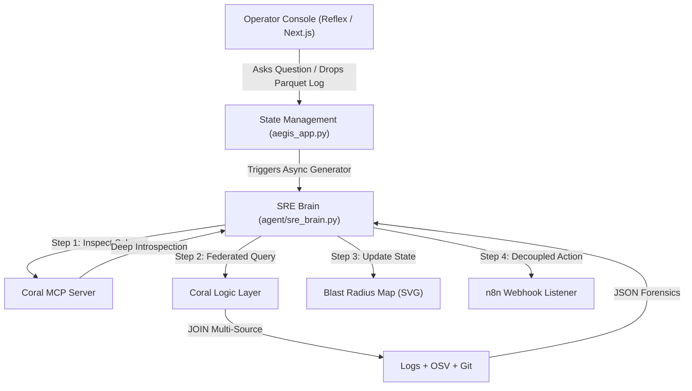

# 🛡️ Aegis SRE: Ultimate Zero-Warehouse Investigator
### Real-Time Forensic Federation for Production Outages
*Developed for the **Pirates of the Coral-bean** Hackathon*

---

Aegis SRE solves a massive real-world corporate crisis: dashboard fatigue and high Mean Time to Resolution (MTTR) during production outages. Instead of forcing engineers to cycle through separate browser tabs—manually correlating Sentry stack traces, GitHub deployment histories, Slack communication threads, and server infrastructure logs—Aegis acts as an intelligent, **Zero-Warehouse** shield.

## 🚀 Key Architectural Upgrades

*   **Native MCP Introspection**: Operates as a Model Context Protocol client to give the AI agent native insight into relational schemas, discovered on-the-fly.
*   **Micro-Sandboxing**: Enforces a strictly isolated environment via `CORAL_CONFIG_DIR`, keeping forensic configurations, logical caches, and credentials private.
*   **Custom Bounty Sources**: Real-time integration with the Google OSV (Open Source Vulnerability) database via handmade YAML mapping specifications.
*   **Asynchronous Forensic Loop**: Leverages Reflex's `@rx.background` decorator to run multi-hop investigations without freezing the user interface.
*   **Interactive Blast Radius Mapping**: A dark-mode topology canvas mapping outage vectors instantly to specific rouge commits (e.g., from dev `TANISHX1`).

## 🧭 System Architecture



## 🛠️ Project Structure

```
aegis-sre/
├── backend/
│   ├── specs/                # Custom Source Mapping Specifications (osv.yaml)
│   ├── logs/                 # Active forensic log stream
│   ├── setup_aegis.sh        # Isolated sandbox initialization script
│   └── aegis_core.py         # Native MCP Client & Background Engine
├── tools/
│   ├── coral_executor.py     # Sandboxed SQL Logic Layer
│   └── n8n_dispatcher.py     # Resilient remediation dispatcher
├── agent/
│   └── sre_brain.py          # Principal SRE reasoning agent
└── aegis_app/
    └── aegis_app.py          # Reactive Python Web Dashboard
```

## 🏁 Quick Start

### 1. Prerequisites
- **Coral CLI**: Install from [withcoral.com](https://withcoral.com)
- **Python 3.10+**: `pip install -r requirements.txt`

### 2. Sandbox Setup (Isolated Forensic Environment)
Initialize the sandboxed environment and register the federated data sources (OSV API + Local Logs):
```powershell
.\backend\setup_aegis.ps1
```

### 3. Generate Forensic Logs
Bootstraps the system with realistic telemetry parquet files in `./logs/`:
```bash
python scratch/generate_mock_parquet.py
```

### 4. Launch the Dashboard
Start the Reflex web application:
```bash
reflex run
```

---

## 🛠️ Project Structure
... (existing structure) ...

1.  **Initialize Virtualenv**:
    ```bash
    python -m venv venv
    source venv/bin/activate
    pip install -r requirements.txt
    ```

2.  **Spin Up Infrastructure**:
    ```bash
    docker compose up -d
    ```

3.  **Boot the Sandbox**:
    ```bash
    chmod +x backend/setup_aegis.sh
    ./backend/setup_aegis.sh
    ```

4.  **Launch the Dashboard**:
    ```bash
    reflex run
    ```
```ini
OPENAI_API_KEY=your-openai-api-key-here
SRE_LLM_MODEL=gpt-4o
N8N_WEBHOOK_URL=http://localhost:5678/webhook/aegis-triage
```
> [!NOTE]
> If `OPENAI_API_KEY` is omitted, the SRE Brain automatically engages **Simulated Mock Mode**. It will generate mock SQL responses, trace vulnerability CVEs, and dispatch fake webhook responses, making it perfect for dry-run setups!

### 3. Run Standalone Diagnostic Tests
Confirm tool integration, retry adapters, and cognitive generators are fully functional by executing the terminal verification script:
```bash
python3 test_runner.py
```

### 4. Launch the Web Application
Start the Reflex web application (Python backend + Next.js frontend generated by Reflex):
```bash
# Compile and bootstrap the dev environment
reflex run
```
Once compilation completes, open your browser and navigate to:
👉 **[http://localhost:3000](http://localhost:3000)**

---

## 🔍 Step-by-Step Incident Investigation Flow

Test the platform with this sample incident triage script:

1. **Upload Telemetry**: Drag a Parquet telemetry log (e.g. `auth_logs.parquet`) into the **Forensic Control** dropzone on the left panel. This writes the file safely into `./logs/`.
2. **Launch a Query**: Select one of the preloaded playbooks (e.g. **Zero-Warehouse Join**) or type a custom command like:
   > *"Check if any of our active telemetry nodes have critical CVE vulnerability packages, find who committed them, and trigger immediate mitigation."*
3. **Trace Thoughts**: Observe the **Agent Cognitive Log** panel stream intermediate logical milestones, detailing how it constructs SQL queries to join database telemetry, osv records, and git commits.
4. **Audit Topology**: View the **Blast Radius Topology** graph on the right panel.
   - Click compromised nodes (flashing neon coral/red) to load their details.
   - Review service names, cluster IPs, active CVE descriptions, and the targeted rollback commands.
5. **Observe Remediation**: Watch the cognitive loop detect that the author of the compromised code is `TANISHX1`, mark the node for quarantine, and successfully fire the resilient webhook to n8n to apply containment patches.

---

> [!TIP]
> **Production Deployment Recommendation**: If containerizing, ensure the `/logs` directory is mapped as a secure local volume, and configure your firewall to restrict direct subprocess execution commands strictly to the Coral CLI namespace.
