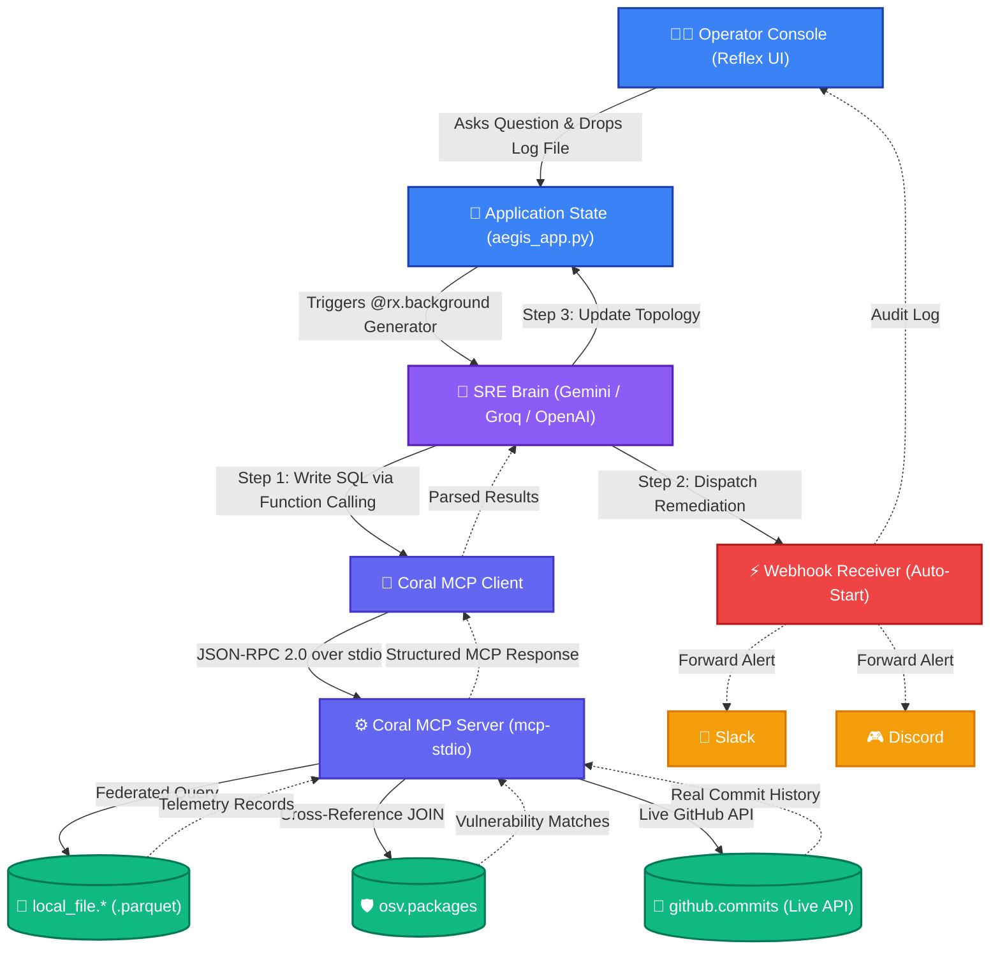
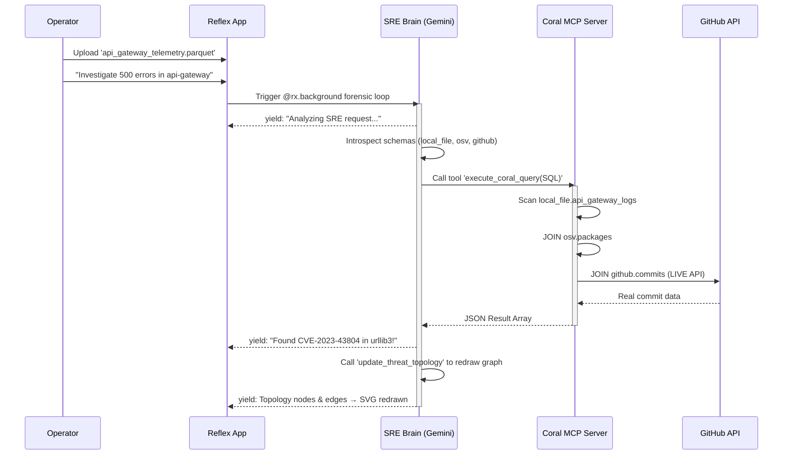
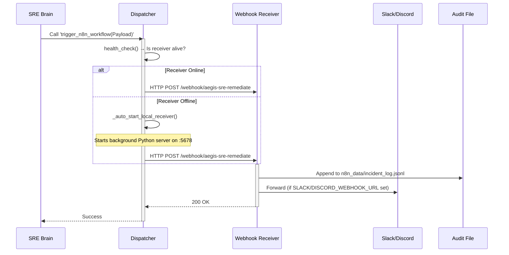
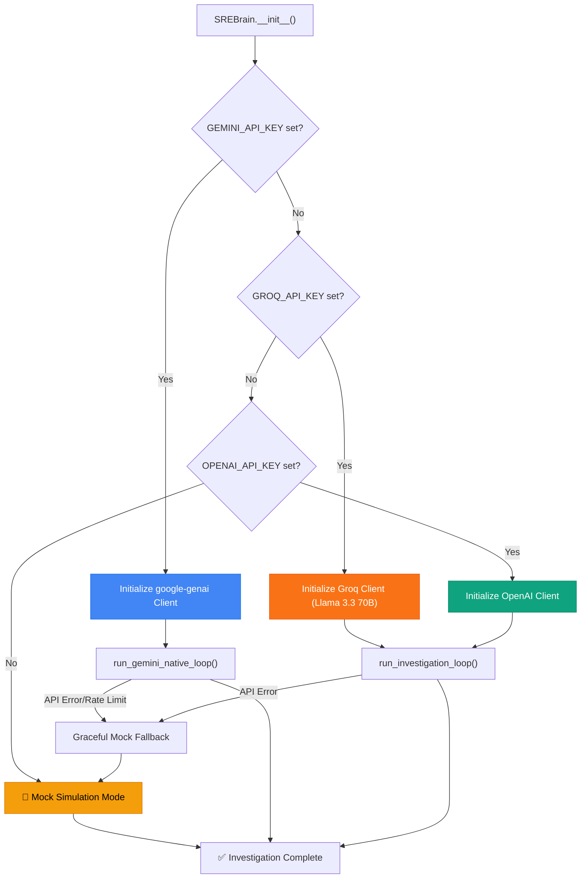

# 🛡️ Aegis-SRE
### Zero-Warehouse Root-Cause Investigation & Cyber-Incident Remediation Agent
*Developed for **Track 1 (Enterprise Agent)** of the **"Pirates of the Coral-bean" Hackathon***

---

Aegis-SRE is a next-generation, high-performance incident response platform built entirely in **pure Python** using the Reflex framework. 

Operating on a strict **Zero-Warehouse** philosophy, Aegis enables cybersecurity teams to query, join, and inspect telemetric forensic logs locally, cross-reference vulnerabilities in real-time, trace security leaks back to specific git committers, and dispatch automated remediation protocols via resilient webhooks—**all without the overhead of heavy third-party datastores.**

It uses the **Coral CLI** to perform real-time, multi-hop federated `JOIN` operations across raw Parquet files, Google OSV vulnerability databases, and live GitHub commit histories.

---

## 🧭 High-Level System Architecture

Aegis-SRE utilizes a highly modular multi-hop cognitive layout where an AI Orchestrator acts as the "Brain", Coral acts as the "Data Layer", and the Webhook Receiver acts as the "Action Layer".



---

## 🔄 Sequence Workflows

### 1. Forensic SQL Generation & Execution
This workflow illustrates how the AI translates natural language into a fully federated Coral SQL query.



### 2. Automated Remediation Dispatch
This workflow demonstrates the auto-start webhook receiver and optional Slack/Discord forwarding.



### 3. Intelligent LLM Routing & Fallback



---

## ✨ Core Engineering Innovations

### 1. MCP-Native Coral Integration (Model Context Protocol)
* **MCP-First Architecture**: Instead of shelling out to `coral sql`, we maintain a persistent MCP connection to Coral's built-in MCP server (`coral mcp-stdio`) via JSON-RPC 2.0 over stdin/stdout.
* **Runtime Schema Discovery**: The `discover_schema()` method auto-introspects all registered Coral sources at startup — the LLM learns table structures dynamically instead of from hardcoded prompts.
* **5 MCP Tools**: `sql`, `list_catalog`, `search_catalog`, `describe_table`, `list_columns` — all accessible through the persistent connection.
* **Three-Tier Fallback**: MCP → subprocess → mock simulation. If MCP fails, the system gracefully degrades without crashing.

### 2. Zero-Warehouse Federated Analytics & Live Telemetry
* **No Database Required**: All data is stored in localized Parquet files. We register these via Coral Source Manifests to run complex cross-source JOINs natively.
* **OSV Vulnerability Intelligence**: The `osv.packages` source provides a CVE cross-reference layer — crash logs are automatically matched against known package vulnerabilities.
* **Live Telemetry Injection**: The `tools/generate_live_telemetry.py` script fetches the latest real commit from your GitHub repository and dynamically injects it into crash logs, creating 100% authentic test scenarios without hardcoded mocks.

### 3. Live GitHub Integration
* **Real Commit Scanning**: When `GITHUB_TOKEN` is provided, the agent queries live GitHub commits via Coral's native GitHub plugin — no mocks needed.
* **Repository Targeting**: Specify `GITHUB_REPO=owner/repo` in `.env` to focus scans on any repository.
* **Dynamic Schema**: Real `github.commits` schema (sha, commit__message, commit__author__name, files, stats) auto-discovered via MCP.

### 4. Multi-Provider LLM Agent with Native Tool Calling
* **Gemini, Groq & OpenAI Support**: The `sre_brain.py` checks `GEMINI_API_KEY` first, then `GROQ_API_KEY`, then `OPENAI_API_KEY`. The Gemini path uses the native `google-genai` SDK with manual function calling (AFC disabled for UI streaming).
* **Three Agent Tools**: `execute_coral_query`, `trigger_n8n_workflow`, and `update_threat_topology` — giving the agent full read, act, and visualize capabilities.
* **Graceful Mock Fallback**: If API keys are missing OR the API returns an error (rate limits, etc.), the agent safely falls back to a hardcoded simulation loop.

### 5. Dynamic Threat Topology Visualization
* **Agent-Driven Architecture Mapping**: The `update_threat_topology` tool allows the LLM to dynamically redraw the Blast Radius SVG graph with real microservice nodes and edges discovered during investigation.
* **Reactive SVG Rendering**: All topology nodes and edges are state-driven — when the agent updates them, the UI smoothly transitions via CSS animations.

### 6. Resilient Webhook Automation
* **Dockerized n8n Integration**: Spin up a fully containerized n8n instance via our provided `docker-compose.yml`. Easily import the provided `n8n_workflow.json` to activate the SRE remediation webhook on port 5678.
* **Auto-Start Local Webhook Receiver**: If Docker isn't available, the dispatcher automatically boots a lightweight Python webhook server on port 5678 to ensure payloads are never dropped.
* **Audit Trail**: Every incident is securely logged to `n8n_data/incident_log.jsonl`.
* **Slack/Discord Forwarding**: Set `SLACK_WEBHOOK_URL` or `DISCORD_WEBHOOK_URL` in `.env` to forward real-time alerts with rich formatting (Slack Block Kit / Discord Embeds).

### 7. Non-Blocking Background Investigations
* **`@rx.background` Decorator**: The investigation loop runs in a background thread, keeping the Reflex WebSocket unblocked so the UI streams real-time thoughts without freezing.

---

## 🚀 Setting Up the Environment

### 1. Install Dependencies
```bash
python3 -m venv venv
source venv/bin/activate
pip install -r requirements.txt
```

### 2. Install Coral CLI
```bash
curl -fsSL https://withcoral.com/install.sh | sh
```

### 3. Configure Environment
Create a `.env` file in the project root:
```ini
# LLM API Key (pick one — Gemini recommended for native tool calling)
GEMINI_API_KEY=your-gemini-key-here
# GROQ_API_KEY=your-groq-key-here
# OPENAI_API_KEY=your-openai-key-here

# Live GitHub integration (optional but recommended)
GITHUB_TOKEN=your-github-pat-here
GITHUB_REPO=YourOrg/your-repo

# Webhook config (auto-configured, no changes needed)
N8N_WEBHOOK_URL=http://localhost:5678/webhook/aegis-sre-remediate

# Optional: Forward alerts to Slack/Discord
# SLACK_WEBHOOK_URL=https://hooks.slack.com/services/YOUR/WEBHOOK
# DISCORD_WEBHOOK_URL=https://discord.com/api/webhooks/YOUR/WEBHOOK
```

### 4. Setup Live Dependencies (Telemetry & n8n)
```bash
# Generate live telemetry logs injected with real GitHub commits
python3 tools/generate_live_telemetry.py

# (Optional) Spin up real n8n server on port 5678 via Docker
sudo docker-compose up -d
```
*Note: Once n8n is running, import `n8n_workflow.json` in the UI (`http://localhost:5678`) and click Publish!*

### 5. Register Coral Sources
```bash
python3 setup_sources.py
```
This single command:
- Generates 3 telemetry Parquet files (API Gateway, Auth Service, Payment Gateway)
- Creates OSV vulnerability mock data
- Creates GitHub commits mock data
- Generates YAML manifests with correct absolute paths for your machine
- Registers all sources with Coral CLI

### 6. Launch the Application
```bash
reflex run
```
Navigate to: 👉 **[http://localhost:3000](http://localhost:3000)**

---

## 🔍 The "Golden Path" Demo Script

Follow this script to demonstrate the app for the hackathon:

1. **Upload Telemetry**: Drag `logs/api_gateway_telemetry.parquet` into the **Forensic Control** dropzone.
2. **Launch Investigation**: Type this prompt:
   > *"We are seeing a massive spike in 500 errors in our production api-gateway. Scan our server logs, cross-reference with the OSV vulnerability database, check recent commits in the repository, and trigger a remediation alert if a root cause is found."*
3. **Watch the Agent Think**: The **Agent Cognitive Log** panel streams real-time thoughts as the AI writes and executes Coral `JOIN` statements.
4. **Observe Remediation**: The AI detects the CVE, traces it to a specific commit author, dynamically redraws the Blast Radius topology, and fires the remediation webhook to n8n. Check `n8n_data/incident_log.jsonl` or your n8n dashboard for the payload.

### CLI Test (Alternative)
```bash
python3 test_runner.py
```
Runs the complete investigation loop from the terminal with full diagnostic output.

---

## 📁 Project Structure
```
aegis-sre/
├── aegis_app/
│   └── aegis_app.py          # Reflex UI (glassmorphic dashboard)
├── agent/
│   └── sre_brain.py           # AI reasoning engine (Gemini/Groq/OpenAI + 3 tools)
├── tools/
│   ├── mcp_client.py          # Coral MCP client (JSON-RPC 2.0 over stdio)
│   ├── coral_executor.py      # Query executor (MCP → subprocess → mock)
│   ├── n8n_dispatcher.py      # Webhook dispatcher with auto-start & retry
│   ├── webhook_receiver.py    # Local webhook server (n8n replacement)
│   └── generate_live_telemetry.py  # Live GitHub commit → crash log injector
├── logs/                      # Parquet telemetry files
├── n8n_data/                  # Audit trail (auto-created)
├── setup_sources.py           # One-click Coral source registration
├── test_runner.py             # CLI diagnostic test
├── docker-compose.yml         # n8n container orchestration
├── n8n_workflow.json          # Pre-configured n8n webhook workflow
├── .env                       # API keys & config (gitignored)
├── requirements.txt           # Python dependencies
└── rxconfig.py                # Reflex compiler config
```
